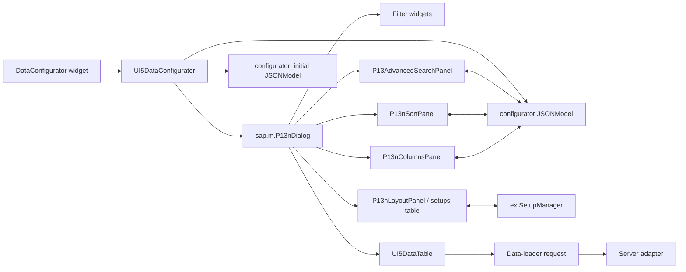

# Data configurator dialogs in UI5

The UI5 data configurator is the personalization dialog used by data widgets, most notably
data tables. It combines normal ExFace filter widgets with UI5 personalization controls for
sorting and columns, a custom advanced-search control, and optional persisted table setups.

The server-side entry point is
[`UI5DataConfigurator`](../../../Facades/Elements/UI5DataConfigurator.php). It renders a
`sap.m.P13nDialog`, creates its JSON models, registers controller event handlers, and translates
the dialog state into data-loader parameters. The configured data widget remains responsible for
applying the resulting state and loading data.

## Architecture

### Main components

| Component | Responsibility |
|---|---|
| [`UI5DataConfigurator`](../../../Facades/Elements/UI5DataConfigurator.php) | Builds the dialog, panels, configuration models, reset logic, and request data. |
| `exface\Core\Widgets\DataConfigurator` | Core widget model exposed by the facade element. |
| `exface\Core\Widgets\DataTableConfigurator` | Adds table-specific optional columns and saved setups. |
| `JqueryDataConfiguratorTrait` | Implements common filter serialization, setters, reset behavior, and apply-on-change registration. |
| `UI5Tabs` | Base UI5 facade element and controller integration. |
| [`UI5DataTable`](../../../Facades/Elements/UI5DataTable.php) | Applies column personalization, synchronizes table-header sorting and filtering, sets indicators, and reloads data. |
| [`P13AdvancedSearchPanel`](../../../Facades/js/openui5.controls.js) | Owns and edits canonical advanced-search conditions in the browser. |
| [`exfSetupManager`](../../../Facades/js/exfSetupManager.js) | Captures, applies, tracks, and locally remembers table setups. |
| [`UI5DataElementTrait`](../../../Facades/Elements/Traits/UI5DataElementTrait.php) | Adds cell context-menu actions that create or remove advanced-search conditions. |
| [`UI5DataColumn`](../../../Facades/Elements/UI5DataColumn.php) | Adds the table-column filter reset action and metadata used by personalization. |
| `exfTools.data.filterComparator` | Parses comparator syntax entered in a table header, including structured `BETWEEN` values. |
| Server adapters | Consume the normalized request filter tree. The OData-specific translation is implemented by [`OData2ServerAdapter`](../../../Facades/Elements/ServerAdapters/OData2ServerAdapter.php). |

### Dialog and model lifecycle

`UI5DataConfigurator::buildJsConstructor()` creates one `sap.m.P13nDialog` and attaches two
separate JSON models:

- `configurator` is the mutable current state.
- `configurator_initial` is the initial state used by Reset.

The current model contains these main paths:

| Path | Contents |
|---|---|
| `/columns` | Column identity, order, visibility, initial visibility, and toggleability. |
| `/sortables` | Attributes available to the Sorting tab. |
| `/sorters` | Active sort expressions and directions. |
| `/searchables` | Attributes available to Advanced Search. |
| `/comparators` | Canonical comparator keys plus translated names and hints. |
| `/advanced_search` | Canonical advanced-search conditions. |
| `/header_filters` | Serialized values of the regular Filters tab, used by saved setups. |

The dialog buttons have deliberately small responsibilities:

- **OK** closes the dialog, asks the data element to apply column personalization, and refreshes
  the configured data widget. During refresh, the configurator state is converted into request
  filters, sorters, and columns.
- **Cancel** only closes the dialog. It does not restore the current model from the initial model.
- **Reset** clears Advanced Search, restores initial sorters and columns, resets regular filters,
  table indicators and custom widths, removes the locally selected setup, and closes the dialog.

The generated request contains regular filters from `JqueryDataConfiguratorTrait` and an additional
`AND` group for non-empty Advanced Search rows. Values are parsed with the formatter of the matching
data column before they are sent. Excluded conditions are inverted at this boundary; an excluded
`BETWEEN` condition becomes an `OR` group below the lower bound or above the upper bound.



## Setups tab

The Setups tab embeds the widget tree produced by `DataTableConfigurator::getSetupsTab()` in a
custom `P13nLayoutPanel`. The table and its actions are Core widget configuration; the UI5 facade
only renders those children and connects their actions to the configured data table.

`UI5DataTable` exposes the setup-related widget functions. Dumping a setup calls
`exfSetupManager.datatable.getConfiguration()`, which collects:

- column order, visibility, and manually assigned widths;
- active sorters;
- non-empty canonical Advanced Search conditions;
- regular filter values from `/header_filters`.

Applying a setup calls `exfSetupManager.datatable.applyConfiguration()`. It updates the Columns,
Sorting, and Advanced Search panels, resets and restores regular filters, then fires the dialog's
OK event so the table is updated immediately. The Advanced Search panel normalizes old UI5
operation names such as `Contains` and `EQ`, which keeps older setup payloads usable.

The manager uses IndexedDB through its Dexie wrapper to remember the current setup for a table.
On view display, an existing local setup is applied automatically. Change tracking listens to
`/columns`, `/sorters`, Advanced Search's `conditionChange` event, and manual column resizing.

This tab needs:

- a `DataTableConfigurator` with setups enabled;
- the Columns tab enabled and a real `DataTable` as configured widget;
- the table's `apply_setup` widget function;
- the setup widgets backed by `exface.Core.WIDGET_SETUP` and `WIDGET_SETUP_USER`;
- `exfSetupManager` and its IndexedDB/Dexie storage support.

## Filters tab

The Filters tab renders the configurator's regular ExFace filter widgets in a responsive
`sap.ui.layout.Grid`. These are full widget controls rather than generic text fields, so selectors,
date inputs, range filters, relation inputs, validation, and data-type-specific behavior continue
to work as configured in the metamodel.

Visible filters are shown in the grid. Hidden filters are still constructed because they may carry
fixed or programmatically supplied request values. Optional filters are constructed hidden and are
offered through Advanced Search instead. Pressing Enter in a suitable filter input triggers the
configured data widget's primary refresh action. `UI5RangeFilter` and `UI5InputComboTable` receive
special handling for their multiple inputs and suggestion behavior.

Serialization, value setters, and reset behavior come primarily from
`JqueryDataConfiguratorTrait`. Before request data is returned, the current regular-filter tree is
also copied to `/header_filters` so setups can persist it. Despite this model path's historical
name, it represents the regular configurator filters and can contain nested groups.

This tab needs:

- `include_filter_tab` enabled;
- filter widgets on the Core `DataConfigurator` model;
- the UI5 facade element for each filter and its input widget;
- `JqueryDataConfiguratorTrait` for request serialization and state restoration.

## Sorting tab

Sorting uses the standard `sap.m.P13nSortPanel`. `/sortables` is built from sortable table columns,
optional columns, and preconfigured sorters. `/sorters` contains the active ordered list with
`attribute_alias` and UI5 direction (`Ascending` or `Descending`). Add, update, and remove events
write directly to that model path.

When the dialog is applied, `buildJsDataLoaderParams()` converts the selected items to the request's
comma-separated `sort` and `order` parameters. For `sap.ui.table.Table`, sorting through a column
header also replaces `/sorters` with that column and direction, suppresses UI5's built-in local
sorting, and lets the normal server refresh handle the operation. After loading, `UI5DataTable`
updates column sort indicators from the effective request.

This tab needs:

- an enabled configurator;
- sortable columns or configured data-widget sorters;
- `UI5DataTable` integration when header sorting and table indicators are required;
- a server-side data source or adapter that understands the generated `sort` and `order` values.

## Advanced Search tab

Advanced Search uses the custom `exface.openui5.P13AdvancedSearchPanel`, not UI5's native filter
panel. This is necessary because ExFace comparators and condition groups cannot be represented
losslessly by `sap.m.P13nFilterItem`.

The panel stores canonical conditions in `/advanced_search`:

```json
{
  "expression": "ATTRIBUTE_ALIAS",
  "comparator": "==",
  "value": "Example",
  "value_from": "",
  "value_to": "",
  "exclude": false,
  "linked_to_header": false
}
```

Supported initial comparators come from `ComparatorDataType` and include `=`, `!=`, `==`, `!==`,
`<`, `<=`, `>`, `>=`, `IN`, `NOT_IN`, and `BETWEEN`. Names and tooltips use the Core comparator
translations. `BETWEEN` has separate lower and upper values. Conditions are displayed in expandable
Include and Exclude sections; both sections retain an empty row, and all rows currently use `AND`.

Searchable attributes come from filterable visible/optional columns and regular filters. Hidden
columns are excluded except for an object's UID attribute. Relation filters target the related
object's label attribute where possible. Duplicate aliases and captions are removed.

### Header-filter synchronization

For `sap.ui.table.Table`, entering comparator syntax in a column header is parsed by
`exfTools.data.filterComparator.extract()`. `UI5DataTable` then calls
`upsertHeaderCondition()` or `removeHeaderCondition()` on the Advanced Search panel. Such rows are
marked `linked_to_header: true`, shown with a chain-link icon, and their attribute selector is
locked.

Synchronization is bidirectional:

- changing a linked Advanced Search row calls `_syncHeaderFilter()` and updates the matching
  `sap.ui.table.Column` filter value and indicator;
- deleting a linked row clears the column header filter;
- clearing a column filter removes only the linked condition for that expression;
- table refresh marks a column as filtered when any Advanced Search condition targets it, even if
  its header input is empty.

The compact header syntax is reconstructed from the canonical condition. A range is written as
`from..to`; other conditions use the comparator prefix followed by the value.

Parsing a canonical condition for transport is intentionally not a panel responsibility. Each
data-type formatter provides `buildJsFilterParser()`. The generated parser returns a normalized
comparator and value. The default implementation parses scalar values and preserves `IN` and
`NOT_IN` list strings. Date and number formatters additionally parse both
serialized `BETWEEN` bounds. Date-time formatters also turn equality comparisons with day or minute
precision into `BETWEEN` ranges. `exfTools.date.getDateTimePrecision()` and `findFilterRange()` centralize
detection and range calculation, including relative date expressions such as `-1d`. Partial
precision is retained by generic text inputs and the Advanced Search model. Dedicated date/time
inputs continue to expose their normalized value, including any time components added visibly by
the control.

`exfTools.data.filterComparator.parseValue()` serializes the normalized condition for transport and
returns an emptiness flag. Both `UI5DataTable` header filtering and `UI5DataConfigurator` request
generation use the same canonical condition model, so code that does not render the Advanced Search
panel is not coupled to a UI control.

### Context-menu integration

The cell context menu is generated by `UI5DataElementTrait`. For filterable columns it obtains the
clicked attribute alias and value, then operates directly on the Advanced Search panel:

- **Include** adds an included `==` condition.
- **Exclude** adds an excluded `==` condition.
- **Clear** removes all conditions for the clicked expression.

Each action reloads the data widget immediately. `UI5DataColumn` provides a related clear-filter
item in the standard column menu; it removes Advanced Search conditions for the column, clears the
header value and indicator, and reloads the table.

### Request and adapter integration

`UI5DataConfigurator::buildJsDataGetter()` reads the canonical conditions and appends one nested
`AND` group to the normal ExFace filter tree. Empty placeholder rows are ignored. Column-specific
filter parsers normalize comparators and values before
`exfTools.data.filterComparator.parseValue()` prepares them for transport.

Most requests send this filter tree to the normal ExFace backend. Direct adapters must translate
the same canonical comparators themselves. `OData2ServerAdapter` maps atomic comparators to UI5
OData operators, expands `IN`/`NOT_IN`, translates ranges, and recursively preserves nested `AND`
and `OR` groups.

This tab needs:

- an enabled configurator;
- `P13AdvancedSearchPanel` loaded from `openui5.controls.js`;
- `/searchables`, `/comparators`, and `/advanced_search` in the named configuration model;
- filterable, attribute-bound columns for data-type parsing;
- `exfTools.data.filterComparator` for table-header syntax;
- compatible handling of canonical comparators in any direct server adapter.

## Columns tab

Columns use `sap.m.P13nColumnsPanel`. `/columns` is built from the data widget's columns plus
optional columns supplied by `DataTableConfigurator`. Reordering or toggling entries rewrites the
model array in panel order.

Before the tab is displayed, its update function aligns the panel's internal item model with the
actual table order. This preserves the position of unchecked columns instead of moving them to the
end. It also evaluates `hidden_if`: a currently hidden column is not toggleable, while a column
whose condition is false remains available for personalization.

On OK, `UI5DataTable::buildJsRefreshPersonalization()` applies order and effective visibility to
either `sap.ui.table.Table` or a responsive `sap.m.Table`. Optional column controls and cells are
created as controller-dependent objects because the configurator itself is constructed before the
table. Columns controlled by a saved setup carry `_exfChangedBySetup`, preventing `hidden_if` from
silently overriding the user's setup. Manual widths are tracked separately in `_exfCustomColWidth`.

The current column list is also sent with every data request. Normal reads include visible columns
plus technically required hidden and `hidden_if` columns; exports send only visible columns.

This tab needs:

- `include_columns_tab` enabled;
- a data widget with column facade elements and their personalization metadata;
- `UI5DataTable::buildJsRefreshPersonalization()` to apply model changes;
- controller-dependent optional column/cell constructors when optional columns are configured.

## Integration rules

When extending the configurator, keep these contracts intact:

1. Treat the named JSON model as dialog state, not as the final table state. Apply changes through
	the owning table or filter element.
2. Use `P13AdvancedSearchPanel` methods instead of mutating `/advanced_search` externally. They
	preserve normalization, placeholder rows, header synchronization, and `conditionChange` events.
3. Keep canonical ExFace comparators in saved setups and requests. Translate them only at the final
	adapter boundary.
4. Mark conditions originating from table headers with `linked_to_header: true`; do not infer the
	relationship solely from the attribute alias.
5. Update `exfSetupManager` when adding persistent panel state, including capture, application,
	change tracking, backward compatibility, and reset behavior.
6. Update both UI table variants when column behavior changes, and verify `hidden_if`, optional
	columns, manual widths, and exports independently.