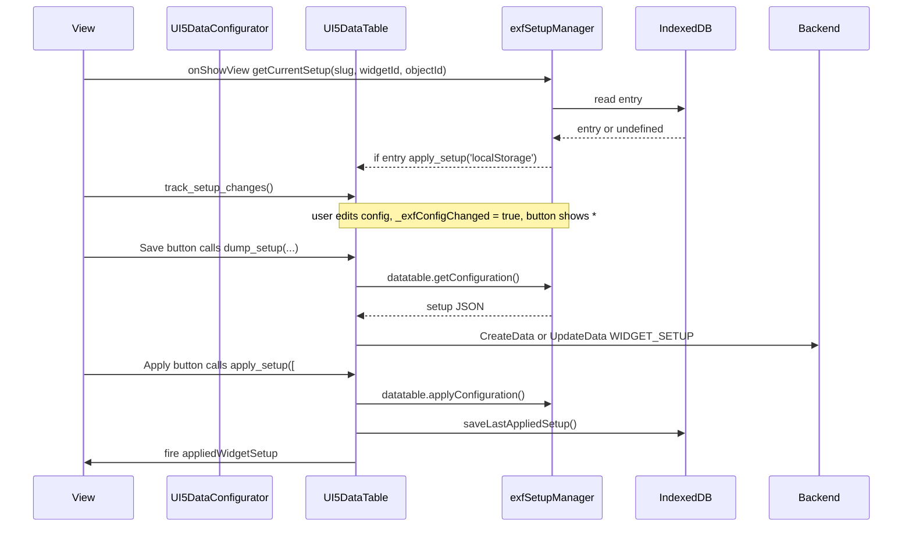

# UI5 data widget setups

A *widget setup* is a named, persisted snapshot of the personalization state of a data widget:
column order, column visibility, manual column widths, sorters, advanced-search conditions and the
values of the regular configurator filters. Users can save setups, share or publish them, mark them
as favorites and re-apply them later. The setup last applied on a device is remembered locally and
re-applied automatically the next time the view is shown.

This page describes the UI5-specific architecture. The personalization dialog that produces and
consumes the setup state is documented in [DataConfigurator.md](DataConfigurator.md).

## Setups are simplified mutations

Setups are closely related to [mutations](https://github.com/ExFace/Core/blob/1.x-dev/Docs/understanding_the_metamodel/Mutations/index.md): they also modify the model of a widget, but under much
stricter rules - so strict that an end user can safely apply them. Consequently every setup
prototype implements `MutationInterface` (extending `AbstractMutation`) and can be used inside the
regular mutation engine as well. The opposite is not true: arbitrary mutations cannot be used as
setups.

A setup represents the configuration state of one specific *configurator* widget type. Every widget
type that supports setups therefore gets its own setup prototype class. Today only
`exface\Core\Mutations\Prototypes\DataTableSetup` exists - `PivotTableSetup`, `ChartSetup`,
`MapSetup` and others will follow, each with the structure its own configurator needs. Do not try
to squeeze another widget type into `DataTableSetup`; the stored setup is bound to a prototype via
the `PROTOTYPE_FILE` attribute of `exface.Core.WIDGET_SETUP`.

The individual things a user can configure - columns, filters, sorters, … - are modeled as
*mutation rule* prototypes in `exface\Core\Mutations\MutationRules\` and referenced from the setup
prototype. That is what keeps setups fully compatible with mutations and allows a setup to be part
of a mutation if needed.

## Where to find what

| Concern | Location |
|---|---|
| All client-side setup logic (IndexedDB, capture, apply, change tracking) | [`Facades/js/exfSetupManager.js`](../../../Facades/js/exfSetupManager.js) |
| Widget functions `dump_setup`, `apply_setup`, `clear_applied_setup`, `track_setup_changes`, `reset_setup_change_tracking` | [`Facades/Elements/UI5DataTable.php`](../../../Facades/Elements/UI5DataTable.php), `buildJsCallFunction()` |
| Setups tab inside the P13n dialog, auto-apply on view show, reset behavior | [`Facades/Elements/UI5DataConfigurator.php`](../../../Facades/Elements/UI5DataConfigurator.php) |
| Setups quick-select menu in the data toolbar | [`Facades/Elements/Traits/UI5DataElementTrait.php`](../../../Facades/Elements/Traits/UI5DataElementTrait.php), `buildJsSetupQuickSelectMenu()` |
| `exface.openui5.P13nLayoutPanel` (host panel for the setups tab) | [`Facades/js/openui5.controls.js`](../../../Facades/js/openui5.controls.js) |
| Setups table, its filters, columns and buttons (model side) | `exface\Core\Widgets\DataTableConfigurator` |
| Widget function constants and their UXON docs | `exface\Core\Widgets\DataTable` (`FUNCTION_APPLY_SETUP`, `FUNCTION_DUMP_SETUP`, …) |
| Persisted setups | Meta objects `exface.Core.WIDGET_SETUP` and `exface.Core.WIDGET_SETUP_USER` |
| UXON schema of the stored configuration | the setup prototype for the widget type, currently only `exface\Core\Mutations\Prototypes\DataTableSetup` |
| Schema of a single configurable aspect | the mutation rules in `exface\Core\Mutations\MutationRules\` - `DataColumnSetupRule`, `FilterSetupRule`, `AdvancedSearchSetupRule`, `SorterSetupRule` |

The UI5 facade owns only the client-side behavior. *Which* setups exist, how they are filtered per
user and which buttons the setups tab offers is Core widget configuration in
`DataTableConfigurator`; the facade merely renders those children and wires their actions to the
configured table.

## Identity of a setup

A setup is bound to a widget by a triple, used identically in the metamodel and in IndexedDB:

| Part | Source in PHP |
|---|---|
| screen `slug` | `$dataWidget->getUiScreen()->getUrlSlug()` |
| `widget_id` | `$dataWidget->getIdInScreen()` |
| `object_id` | `$dataWidget->getMetaObject()->getId()` |

The slug identifies the *screen* (page or dialog - see [global UI structure](https://github.com/ExFace/Core/blob/1.x-dev/Docs/understanding_the_metamodel/Global_UI_principles/index.md)), so a dialog that is reused on
several pages keeps its setups. Setups whose screen or widget can no longer be resolved are flagged
by the Core cleanup handler `DataTableConfigurator::onCleanUp()` and filtered out of the setups
table.

## Storage

### Server side

Setups are normal metamodel data:

- `exface.Core.WIDGET_SETUP` holds `NAME`, `DESCRIPTION`, `SETUP_UXON` (the JSON payload below),
  `SLUG`, `WIDGET_ID`, `OBJECT`, `PROTOTYPE_FILE`, `PRIVATE_FOR_USER`, `APP` and `ORPHANED_FLAG`.
- `exface.Core.WIDGET_SETUP_USER` holds per-user flags for a setup - `FAVORITE_FLAG` and
  `DEFAULT_SETUP_FLAG` - so several users can annotate the same shared setup.

### Client side

`exfSetupManager` remembers the *last applied* setup per widget in IndexedDB through Dexie:

- database `exf-ui5-widgets`, schema version 3, store `setups`
- primary key `[slug+widget_id+object_id]`, secondary indexes `setup_uid` and `date_last_applied`
- entry: `{slug, widget_id, object_id, setup_uid, setup_uxon, setup_name, date_last_applied}`

IndexedDB cannot change the primary key of an existing store, so version 2 deletes the v1 store and
version 3 recreates it with the current key. Entries created before that upgrade are lost by design.

This local entry is a *device preference*, not a second source of truth: it is written only when a
user applies a setup explicitly, and it is deleted when the configurator is reset or when the
applied setup is deleted.

## Setup payload

`SETUP_UXON` is **the UXON model of the setup mutation** identified by `PROTOTYPE_FILE` - for a
`DataTable` that is `DataTableSetup`. Most of its keys (`columns`, `advanced_search`, `sorters`, …)
are arrays of *mutation rule* models: one rule model per column, per filter, per sorter. So the
client-side payload below is not an ad-hoc JSON format, it is the same UXON that the mutation
engine would consume.

The practical consequence: to add a new configurable aspect to a setup type, add a new mutation
rule prototype in `exface\Core\Mutations\MutationRules\` and wire it into the setup prototype with
a setter carrying `@uxon-property` and `@uxon-type \…\YourSetupRule[]`. Nothing else in the
architecture has to change on the model side.

The payload is produced by `exfSetupManager.datatable.getConfiguration()` and consumed by
`exfSetupManager.datatable.applyConfiguration()`:

```json
{
  "columns": [
    {"column_name": "COL1", "show": true, "custom_width": "150px"}
  ],
  "sorters": [
    {"attribute_alias": "ATTR2", "direction": "Ascending"}
  ],
  "advanced_search": [
    {"attribute_alias": "ATTR1", "comparator": "=", "value": "Test", "value_from": "", "value_to": "", "exclude": false, "linked_to_header": false}
  ],
  "header_filters": [
    {"expression": "ATTR3", "comparator": "==", "value": "X"},
    {"nested": true, "group": {"operator": "OR", "conditions": []}, "value": "X"}
  ]
}
```

Notes on the contract:

- `columns` uses `column_name`. Older setups used `attribute_alias`; `applyConfiguration()` still
  matches on it, so never drop that fallback.
- `custom_width` only exists for columns the user resized manually (`_exfCustomColWidth`) and is
  only applied to `sap.ui.table.Table`.
- `sorters` use UI5 directions (`Ascending`/`Descending`), matching the `/sorters` model path.
- `advanced_search` stores canonical ExFace comparators exactly as the Advanced Search panel keeps
  them. Empty rows are skipped on capture.
- `header_filters` are the values of the regular Filters tab, read from the `/header_filters` model
  path. Filters with a custom condition group are stored as `{nested: true, group: …}` and matched
  again on apply by comparing the group UXON.
- Because this structure *is* the UXON schema of `DataTableSetup`, setups can also be deployed as
  mutations with an app, and the UXON editor can offer autosuggest for them.
- Every other widget type will have its own payload structure, defined by its own setup prototype
  and its own rules - the JS side of a future `ChartSetup` or `PivotTableSetup` must mirror that
  prototype, not this one.

## Client-side API

All of it lives in `exfSetupManager`; PHP only generates calls into it.

| Function | Purpose |
|---|---|
| `datatable.getConfiguration(sTableId, sP13nId, sP13nModelName, sSearchPanelId)` | Captures the payload above from the P13n models, the Advanced Search panel and the table columns. |
| `datatable.applyConfiguration(sTableId, sP13nModelName, sColumnsPanelId, sSortPanelId, sSearchPanelId, oSetup)` | Writes columns, sorters, advanced search and header filters back. |
| `datatable.trackConfigChanges(sTableId, sP13nId, sP13nModelName, sSearchPanelId)` | Attaches the dirty-state listeners. |
| `datatable.getFreezeColumnsCount(…)` / `attachFrozenColumnChangeListener(…)` | Keeps `sap.ui.table.Table` frozen columns correct when setups change visibility. |
| `dexie.getCurrentSetup/saveLastAppliedSetup/deleteCurrentSetup(slug, widgetId, objectId, …)` | Local "last applied" entry. |
| `getSetupProperty(slug, widgetId, objectId, mPassedData, sKey)` | Returns passed data as a promise, or falls back to the IndexedDB entry. This is what makes `apply_setup` work both with row data and with `'localStorage'`. |
| `resetChangeTracking(sWidgetId)` | Clears the dirty flag and the quick-select button model. |
| `markCurrentSetupAsActive(…)`, `updateQuickSelectButtonCaption(…)`, `getQuickSelectButtonSuffix()` | UI feedback for the applied setup. |
| `fireWidgetSetupChangedEvent(sFullWidgetId)` | Fires the custom UI5 event `appliedWidgetSetup` on the table. |

`applyConfiguration()` deliberately does more than restore values:

- unknown or missing columns are appended as hidden, so old setups survive table changes;
- columns hidden by a setup are marked `_exfChangedBySetup` so a `hidden_if` condition cannot
  silently re-show them (see `UI5DataColumn::buildJsSetHidden()`);
- the Columns panel is refreshed through the panel's stored `_exfTabColumnsUpdate` function,
  because the checkboxes are not touched by the user;
- header filters are reset through `fnResetVisibleHeaderFilters` and set through
  `fnSetVisibleHeaderFilters` - both stored as data on the table by
  `UI5DataConfigurator::buildJsVisibleFilterValueSetter()`, because a setter function cannot be
  passed through a `CallWidgetFunction` originating from a dialog action.

## Widget functions

`UI5DataTable::buildJsCallFunction()` implements the functions declared in `DataTable`:

| Function | Behavior |
|---|---|
| `dump_setup(SETUP_UXON, SLUG, WIDGET_ID, PROTOTYPE_FILE, OBJECT, PRIVATE_FOR_USER[, autoApply])` | Captures the current configuration and writes it plus the identity triple into the action's input data. `PRIVATE_FOR_USER` is only filled when creating a new setup, so updating a public setup does not make it private. With `autoApply = true` it chains into `apply_setup`. |
| `apply_setup([#SETUP_UXON#])` or `apply_setup('localStorage')` | Resolves the payload from the request row or from IndexedDB via `getSetupProperty()`, applies it, fires the P13n OK event, and - for a manual apply - stores the entry via `saveLastAppliedSetup()`. Finally resets change tracking and fires `appliedWidgetSetup`. |
| `clear_applied_setup()` | Called before deleting a setup: if the deleted UID equals the locally stored one, removes the IndexedDB entry and presses Reset. |
| `track_setup_changes()` | Delegates to `datatable.trackConfigChanges()`. |
| `reset_setup_change_tracking()` | Clears the dirty flag, re-initializes the quick-select model and re-attaches the frozen-column listener. |

## Lifecycle



### Opening the configurator

`UI5DataConfigurator::buildJsConstructor()` registers two on-show scripts when the setups tab
exists: one reads the IndexedDB entry and calls `apply_setup('localStorage')` if there is one, the
other starts change tracking. The setups table itself is created with `setAutoloadData(false)` and
refreshed in the dialog's `afterOpen`.

### Saving and updating

The buttons come from `DataTableConfigurator`. Save runs a `ShowObjectCreateDialog` whose action
chain calls `dump_setup()` and then creates `WIDGET_SETUP` plus the `WIDGET_SETUP_USER` entry;
Update calls `dump_setup(…, true)` followed by `UpdateData`. Share, publish and edit are separate
Core actions and do not involve the facade.

### Resetting

The dialog's Reset button restores initial columns and sorters, clears Advanced Search and the
regular filters, clears `_exfChangedBySetup` on all table columns, deletes the IndexedDB entry via
`dexie.deleteCurrentSetup()` and calls `reset_setup_change_tracking()`. Reset therefore also means
"stop using the locally remembered setup".

## Change tracking and the quick-select menu

`trackConfigChanges()` sets `_exfConfigChanged` on the table and listens to:

- the `/columns` and `/sorters` bindings of the configuration model,
- `conditionChange` of the Advanced Search panel,
- `columnResize` of the table, ignoring programmatic resizes flagged by `_exfIsAutoResizing`.

The quick-select menu is built by `UI5DataElementTrait::buildJsSetupQuickSelectMenu()` when
`hasSetupsQuickSelector()` is true - that requires setups on the configurator, a `UI5DataTable`
element and the facade config option `WIDGET.DATA.SETUPS.QUICK_SELECT_ENABLED`. Its button id is
the table id plus `exfSetupManager.getQuickSelectButtonSuffix()` (`_setupQuickselectBtn`), and its
JSON model carries `buttonCaption` and `configChanged`, the latter rendering the `*` dirty marker.
The menu binds the *same* model as the setups table in the dialog, so both views stay consistent.
On `appliedWidgetSetup` the trait updates the caption and the active marker in the setups table.

## Rules for extending

1. Any new persistent panel state must be handled in all five places: capture in
	`getConfiguration()`, restore in `applyConfiguration()`, dirty detection in
	`trackConfigChanges()`, reset in `UI5DataConfigurator::buildJsResetter()`, and a tolerant
	fallback for payloads that do not contain the new key. On the model side it needs a mutation
	rule prototype plus a setter on the setup prototype - never an undeclared key.
2. Keep the payload additive and backward compatible - old setups are real user data stored in the
	database and are never migrated automatically.
3. A setup prototype describes exactly one configurator widget type. New widget types get a new
	setup prototype, reusing the existing mutation rules wherever the aspect is the same.
4. Store canonical ExFace comparators; translate only at the adapter boundary.
5. Use the identity triple everywhere. Never key local storage by page UID or by the full UI5
	control id.
6. Do not mutate `/advanced_search` directly - use the `P13AdvancedSearchPanel` methods so header
	synchronization and events stay intact.
7. Setup-controlled column visibility must keep setting `_exfChangedBySetup`, otherwise `hidden_if`
	overrides the user's setup.